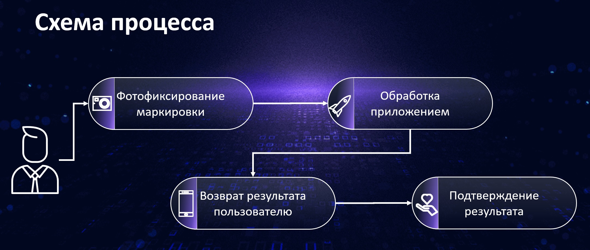
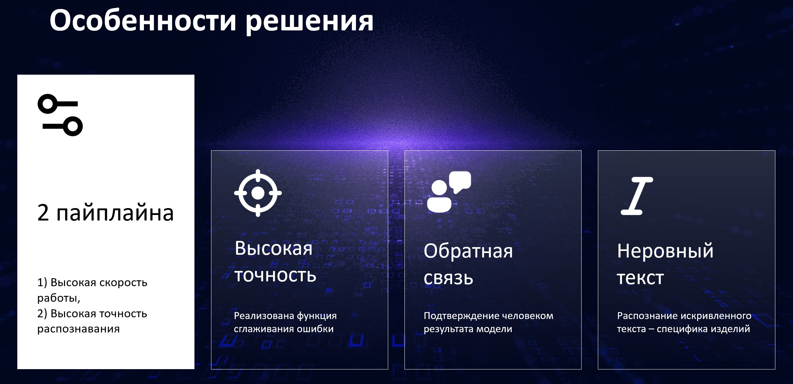

# 🛠️ Rosatom Label Scanner


**Rosatom Label Scanner** — это проект, предназначенный для автоматизации процесса детектирования и распознавания маркировок на металлических деталях для компании Росатом. Проект включает в себя API сервер, Telegram бота и модели машинного обучения для анализа и обработки изображений с маркировками.

**Схема процесса**



**Особенности проекта**




- **Screencast**: [Screencast]([https://drive.google.com/file/d/1OJIFAM_Es7rMaUfGjTYF8ITp3sW3QUta/view?usp=drive_link](https://drive.google.com/file/d/1OJIFAM_Es7rMaUfGjTYF8ITp3sW3QUta/view?usp=drive_link)

Проект состоит из двух основных частей:

1. **API сервер** — обеспечивает взаимодействие с моделями и управление данными.
2. **Telegram Bot** — предоставляет удобный интерфейс для общения и запросов к AI через Telegram.

## 📋 Основные компоненты

### 1. API Сервер 🌐

API сервер предоставляет интерфейс для взаимодействия с моделями машинного обучения, позволяя отправлять запросы и получать результаты.

### 2. Telegram Bot 🤖

Telegram Bot обеспечивает удобный доступ к моделям, позволяя пользователям отправлять команды и получать ответы напрямую в мессенджере.


## 🚀 Как запустить проект

### Предварительные требования

1. Установлен [Docker](https://docs.docker.com/get-docker/).
2. Установлен [Poetry](https://python-poetry.org/docs/#installation) для управления зависимостями Python.
3. Установлен [Make](https://www.gnu.org/software/make/) для автоматизации команд.

### Скачивание и подготовка проекта

```bash
# Клонируем репозиторий
git clone https://github.com/RomanLazovskiy/rosatom_label_scanner.git

# Переходим в директорию проекта
cd rosatom_label_scanner
```

### Запуск целового проекта

#### Необходимо заполнить или создать файл .env по пути `rosatom_label_scanner/tg_bot/.env`

```
TELEGRAM_BOT_TOKEN=<YOUR_BOT_TOKEN>
```
##### ℹ️ Info
Если вы разворачиваете проект без помощи Docker (локально) то необходимо в env файл прописать значение для переменной.
```
API_URL= 0.0.0.0:8001/api/predict
```

```bash
# Активипуем виртуальное окружение для проекта
make env

# Устанавливаем зависимости с помощью Poetry
poetry install

# Запускаем проект полностью
make start-all-project
```

### Установка зависимостей для API сервера

API сервер имеет свои зависимости и `pyproject.toml` файл внутри директории `api`. Перейдите в директорию `api` и установите зависимости:

```bash
# Переходим в директорию API
cd api

# Устанавливаем зависимости с помощью Poetry
poetry install

# Возвращаемся в корневую директорию
cd ..
```

### Установка зависимостей для Telegram бота

Аналогично, Telegram бот имеет свои зависимости и `pyproject.toml` файл внутри директории `tg_bot`. Перейдите в директорию `tg_bot` и установите зависимости:

```bash
# Переходим в директорию Telegram бота
cd tg_bot

# Устанавливаем зависимости с помощью Poetry
poetry install

# Возвращаемся в корневую директорию
cd ..
```

### Скачивание необходимых данных и моделей для API

```bash
# Скачиваем необходимые данные и модели
make download-data
```

### Запуск API сервера

Сборка и запуск Docker-контейнера для API:

```bash
# Сборка Docker-образа для API
make build-api

# Запуск Docker-контейнера для API
make run-api

# Просмотр логов API
make logs-api
```

API сервер запустится на порту `8001`. Вы можете изменить порт, указав его в `Makefile` или в переменных окружения.

### Запуск Telegram Bot

#### Запуск бота локально

Для отладки или разработки можно запустить бота локально:

```bash
# Локальный запуск бота
make run-bot-local
```

#### Запуск Telegram Bot через Docker

Для развертывания бота в Docker:

```bash
# Сборка Docker-образа для бота
make build-bot

# Запуск Docker-контейнера для бота
make run-bot

# Просмотр логов бота
make logs-bot
```

## 🛠️ Команды Makefile

Ниже представлен список доступных команд `Makefile`:

### Для API

- **build-api**: Сборка Docker-образа для API.
- **run-api**: Запуск Docker-контейнера для API.
- **restart-api**: Перезапуск Docker-контейнера для API.
- **stop-api**: Остановка и удаление Docker-контейнера для API.
- **clean-api**: Удаление Docker-образа для API.
- **logs-api**: Просмотр логов контейнера для API.
- **shell-api**: Вход в контейнер для API.
- **download-data**: Скачивание файлов с Google Диска для API.

### Для Telegram Bot

- **build-bot**: Сборка Docker-образа для Telegram бота.
- **run-bot**: Запуск Docker-контейнера для Telegram бота.
- **run-bot-local**: Запуск Telegram бота локально.
- **restart-bot**: Перезапуск Docker-контейнера для Telegram бота.
- **stop-bot**: Остановка и удаление Docker-контейнера для Telegram бота.
- **clean-bot**: Удаление Docker-образа для Telegram бота.
- **logs-bot**: Просмотр логов контейнера для Telegram бота.
- **shell-bot**: Вход в контейнер для Telegram бота.

## 🗂️ Структура репозитория

```
rosatom-label-scanner/
├── api/                            # Директория с кодом API сервера
│   ├── data/                       # Данные для работы API (необходимо скачать с помощью make download-data)
│   │   ├── database.xlsx           # Файл со всем наименованиями деталей
│   ├── models/                     # Модели машинного обучения (необходимо скачать с помощью make download-data)
│   ├── scripts/                    # Скрипты для API
│   │   ├──  utils.py               # Вспомогательные функции для работы инференса
│   │   └──  inference.py           # Скрипт для инференса
│   ├── routes/                     # Директория для маршрутов API
│   │   └──  predict.py             # Логика для основного эндпоинта API
│   ├── pyproject.toml              # Зависимости и настройки для API
│   ├── poetry.lock                 # Блокировка версий зависимостей для API
│   ├── Dockerfile                  # Dockerfile для API сервера
│   └── main.py                     # Основной файл запуска API
├── tg_bot/                         # Директория с кодом Telegram бота
│   ├── handlers/                   # Директория для скриптов команд и сообщений бота
│   │   └── handlers.py             # Обработчики команд и сообщений бота
│   ├── .env                        # Файл окружения для Telegram бота (не добавляется в репозиторий)
│   ├── pyproject.toml              # Зависимости и настройки для Telegram бота
│   ├── poetry.lock                 # Блокировка версий зависимостей для Telegram бота
│   ├── Dockerfile                  # Dockerfile для Telegram бота
│   └── main.py                     # Основной файл запуска бота
├── media/                          # Директория для контента приложений
├── Makefile                        # Makefile для автоматизации команд
├──pyproject.toml                   # Зависимости и настройки для основного проекта
├── poetry.lock                     # Блокировка версий зависимостей для основного проекта
├── .gitignore                      # Файл .gitignore для исключения файлов и директорий из репозитория
└── README.md                       # Описание проекта и инструкции
```

## 📞 Контакты

Если у вас есть вопросы или предложения, вы можете связаться с командой разработчиков:

### 🍊 Лазовский Роман Владимирович
- **Email**: [r.v.lazovskiy@gmail.com](mailto:r.v.lazovskiy@gmail.com)
- **Telegram**: [@rvlazovskiy](https://t.me/rvlazovskiy)

---

### 🍊 Кайгородцев Даниил Сергеевич
- **Email**: [kaigorodtsev-daniil@yandex.ru](mailto:kaigorodtsev-daniil@yandex.ru)
- **Telegram**: [@d_kaigorodtsev](https://t.me/d_kaigorodtsev)

---

### 🍊 Мальцев Артем Юрьевич
- **Email**: [maltsevt@yandex.ru](mailto:maltsevt@yandex.ru)
- **Telegram**: [@martyur](https://t.me/martyur)
